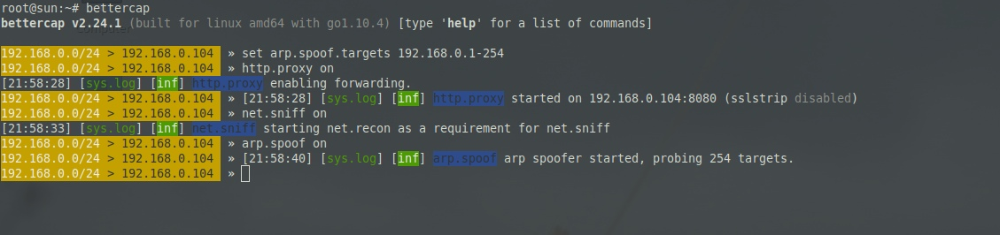
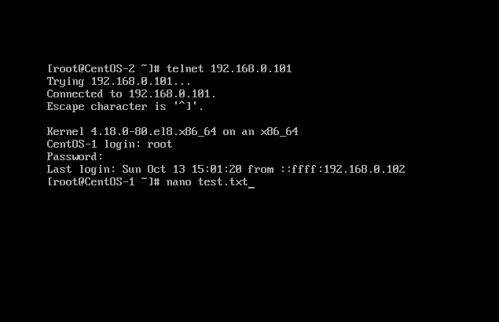
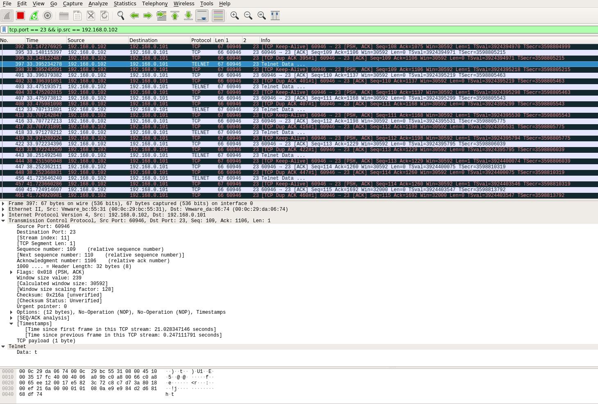
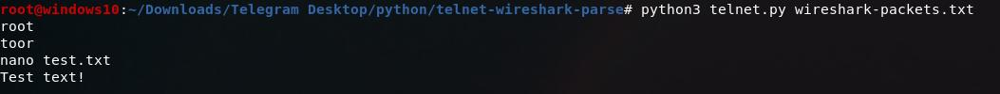

## Parser telnet data from wireshark logs
(1) Start ARP spoofing  
  
(2) Connect to VM from another VM across telnet  
  
(3) Start packets logging with filter on 23 port  
  
(4) Script works  
  
  
## Парсер данных telnet из логов wireshark
(1) Включаем ARP spoofing  
  
(2) Подключаемся с одной виртуальной машины на другую через telnet  
  
(3) Начинаем сбор пакетов с фильтром на 23 порт  
  
(4) Сам скрипт  

